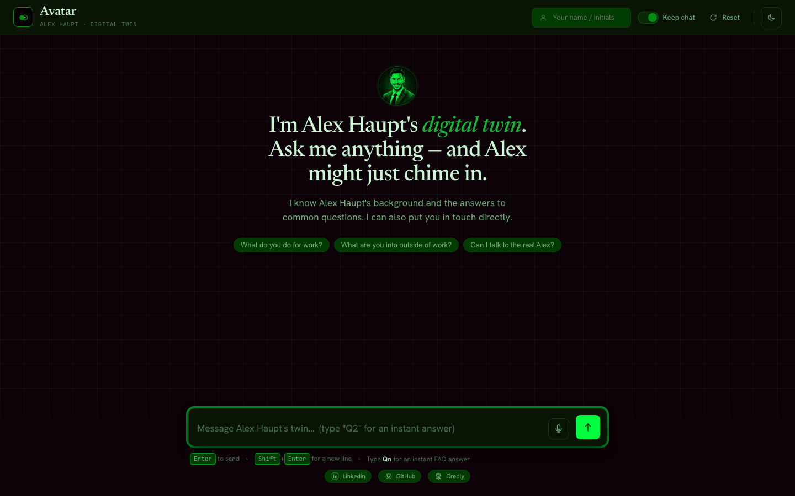

# Avatar

Interact with a digital version of me

<p align="center"></p>

## Introduction

Avatar is my Digital Twin: an AI version of me that visitors to my site can chat with. It knows my background, answers common questions, and puts visitors in touch with me directly when they ask to connect, or when it doesn't know the answer. I can jump into any conversation from an admin dashboard, and visitors see it happen live, right in the thread. An optional voice channel lets visitors actually talk to the twin, in my own cloned voice, via [ElevenLabs](https://elevenlabs.io) — see [SPEC-VOICE.md](SPEC-VOICE.md).

It's live at **[avatar.hauptsec.xyz](https://avatar.hauptsec.xyz)**.

Under the hood it's a FastAPI + vanilla TypeScript app built with [Claude Code](https://claude.com/claude-code) from the specs in this repo ([SPEC-AVATAR.md](SPEC-AVATAR.md), [SPEC-VOICE.md](SPEC-VOICE.md)), using the OpenAI Agents SDK via OpenRouter, Supabase for storage, and deployed as a single container on Fly.io. Those specs, along with the design system (`design-system/`), stay accurate as the project evolves — so if you'd rather stand up your own digital twin than read the code cold, the setup below is a solid starting point: work through **Setup instructions** and **Personalize the twin**, or point Claude Code at this repo and ask it to build from `SPEC-AVATAR.md`.

## Setup instructions

All secrets live in a single `.env` file in the project root. By the end of this section it should contain:

```
OPENROUTER_API_KEY=sk-or-v1-...
MODEL=openai/gpt-5.4-nano
OWNER_NAME=Alex Haupt
ADMIN_PASSWORD=your-chosen-admin-password
PUSHOVER_USER=...
PUSHOVER_TOKEN=...
SUPABASE_URL=https://your-project-ref.supabase.co
SUPABASE_KEY=sb_secret_...
SESSION_SECRET=a-long-random-string
COOKIE_SECURE=0
```

`OWNER_NAME` is the name of the person this Digital Twin represents (you). It is shown in the UI - the site header/subtitle, the page title, how the Avatar refers to itself, and on your own messages when you join a conversation from admin (e.g. "Alex Haupt - live"). Set it to how you want your name to appear. It is configuration, never hardcoded, so each owner sets their own.

`SESSION_SECRET` signs the admin session cookie. It is optional locally - if unset, it is derived from `ADMIN_PASSWORD` - but set it to a long random value (e.g. run `openssl rand -hex 32`) so that changing your admin password later does not invalidate live admin sessions. `COOKIE_SECURE` gates whether that cookie requires HTTPS: leave it `0` (or unset) for local http; it is set to `1` automatically in production (see [Deploy to fly.io](#deploy-to-flyio)).

### OpenRouter

The Avatar's LLM calls go through [OpenRouter](https://openrouter.ai). If you already have a key in `.env`, skip this.

1. Go to https://openrouter.ai and sign in (or sign up).
2. Click your avatar (top right) and choose **Keys**, or go straight to https://openrouter.ai/keys.
3. Click **Create Key**, give it a name (e.g. `avatar`), and click **Create**.
4. Copy the key (it starts with `sk-or-v1-`) and add it to `.env`:
   ```
   OPENROUTER_API_KEY=sk-or-v1-...
   ```
5. Add some credit under **Settings > Credits** if your account has none. The Avatar uses the model in `MODEL`. `openai/gpt-5.4-nano` is very cheap and good for development and testing; for a live site, consider a stronger model such as `openai/gpt-5.4-mini` (just set `MODEL` accordingly).

### Supabase

Conversations are stored in a single Postgres table in Supabase. Follow these steps exactly.

> Note on keys: Supabase changed its API keys in 2026. The legacy `anon` / `service_role` keys are being retired, and new projects no longer offer them. We use the new **secret key** (format `sb_secret_...`). It is used only by the backend server, never in the browser, so it can safely have full access to the table.

#### 1. Create the project

1. Go to https://supabase.com and sign in (or sign up - the free tier is fine).
2. On the dashboard, click the green **New project** button.
3. Pick your organization, give the project a **Name** (e.g. `avatar`), and set a **Database Password** (you can let it generate one - you will not need it for this app, but save it anyway).
4. Choose a **Region** close to you.
5. You will see three checkboxes on the create form. Set them as follows:
   - **Enable Data API** - leave this **ON** (checked). The backend reaches the table through this API; if it is off, nothing works.
   - **Automatically expose new tables** - you can leave this on, or turn it **OFF** for tighter manual control (recommended; it is becoming the default). The SQL below adds an explicit grant for our table, so it works either way.
   - **Enable automatic RLS** - leave this **OFF** (unchecked, the default). Only the backend touches the database, using the secret key, which bypasses Row Level Security; the backend enforces admin access itself.
6. Click **Create new project** and wait about a minute for it to finish provisioning before continuing.

#### 2. Create the table

1. In the left sidebar, click the **SQL Editor** icon (looks like `>_`).
2. Click **+ New snippet** (top left of the editor).
3. Paste in the SQL below, then click **Run** (bottom right, or press Cmd/Ctrl+Enter):

   ```sql
   create table public.messages (
     id              bigint generated always as identity primary key,
     conversation_id uuid not null,
     conversation_name text,
     role            text not null check (role in ('visitor', 'avatar', 'human')),
     content         text not null,
     tool_calls      jsonb,
     needs_attention boolean not null default false,
     read            boolean not null default false,
     created_at      timestamptz not null default now()
   );

   create index messages_conversation_id_idx on public.messages (conversation_id);
   create index messages_created_at_idx on public.messages (created_at desc);

   -- Give the backend's secret key (service_role) access to the table.
   -- Required if you disabled "Automatically expose new tables"; harmless otherwise.
   grant select, insert, update, delete on public.messages to service_role;
   ```

4. When you click **Run**, Supabase shows a warning: *"This query creates a table without enabling Row Level Security..."* with two buttons. Click **Run without RLS** (the yellow one), NOT "Run and enable RLS". This is **expected and safe for this app**: we deliberately do not use RLS, because the table is only ever accessed by the backend's secret key, and the anon/publishable key is never used anywhere in this project, so there is no client that could reach the table. (If you do click "Run and enable RLS" by mistake, it still works - the secret key bypasses RLS - but "Run without RLS" is the intended choice.)

5. You should see **Success. No rows returned**. The table is now created.

   What the columns are for:
   - `conversation_id` - the unique id assigned to each visitor's chat
   - `conversation_name` - optional friendly name for the conversation
   - `role` - who sent the message: `visitor`, `avatar`, or `human` (you)
   - `content` - the message text
   - `tool_calls` - records any tools the Avatar used (for future expansion)
   - `needs_attention` - set when the Avatar pushes you a notification; cleared when you read it
   - `read` - whether you (the human) have read this message in the admin panel
   - `created_at` - timestamp

#### 3. Get the Project URL

1. In the left sidebar, click **Settings** (the gear icon at the bottom).
2. Click **Data API**.
3. Find the **API URL** (it may show as `https://your-project-ref.supabase.co/rest/v1/`). Copy only the **base** part, WITHOUT the trailing `/rest/v1/` - the client adds that itself. Add it to `.env`:
   ```
   SUPABASE_URL=https://your-project-ref.supabase.co
   ```
   For example, if Supabase shows `https://vsdbgmlilyduqkybcltg.supabase.co/rest/v1/`, you would use `https://vsdbgmlilyduqkybcltg.supabase.co`.

#### 4. Get the secret key

1. Still in **Settings**, click **API Keys**.
2. Make sure you are on the **API Keys** tab (NOT the "Legacy anon, service_role API keys" tab - we do not use those).
3. Under **Secret keys**, there is a default secret key. Click **Reveal** (or create one with **Create new secret key** if none exists), then copy the value (it starts with `sb_secret_`).
4. Add it to `.env`:
   ```
   SUPABASE_KEY=sb_secret_...
   ```

> Keep the secret key private. It has full access to your database and must only ever live in `.env` on the server - never commit it and never use it in the frontend.

That's it - once all the values above are in `.env`, the setup is complete.

### Voice (optional)

The base app (above) is text-only. [`SPEC-VOICE.md`](SPEC-VOICE.md) adds an optional voice channel — visitors can talk to the twin, in your own cloned voice, via [ElevenLabs' Agents platform](https://elevenlabs.io) (formerly "Conversational AI"). Skip this whole section if you only want text chat; nothing else in the app depends on it.

Add to `.env`:

```
ELEVENLABS_API_KEY=...
ELEVENLABS_AGENT_ID=
ELEVENLABS_VOICE_ID=...
ELEVENLABS_WEBHOOK_SECRET=a-long-random-string
VOICE_MAX_SESSION_SECONDS=600
ELEVENLABS_LLM=gpt-4o-mini
```

`ELEVENLABS_LLM` is separate from text chat's `MODEL`/`OPENROUTER_API_KEY` and *not* an OpenRouter identifier — it's one of ElevenLabs' own managed models. Voice can't use Custom LLM/OpenRouter the way text chat does if your voice is an **Instant Voice Clone**: ElevenLabs rejects that combination outright (confirmed against a live account, not just their docs). A **Professional Voice Clone** doesn't have this restriction, if you'd rather keep both channels on the same OpenRouter model later.

1. **Clone your voice.** In the ElevenLabs dashboard, go to **Voices > Add a voice** and create an Instant or Professional Voice Clone (see their docs for sample-audio requirements). Copy the resulting voice id into `ELEVENLABS_VOICE_ID`.
2. **Get an API key.** In the dashboard, go to **Profile > API Keys**, create one with full Conversational AI (`convai`) read+write permissions (a narrowly-scoped key will fail with `missing_permissions` errors), and add it to `ELEVENLABS_API_KEY`. Leave `ELEVENLABS_AGENT_ID` blank for now — the next step creates it.
3. **Generate a webhook secret** (e.g. `openssl rand -hex 32`) and set `ELEVENLABS_WEBHOOK_SECRET`. This both signs the post-call transcript webhook and authenticates the two tool webhooks (`faq_tool`, `push_tool`) — it's the same value on both ends.
4. **Run the migration below** (Supabase SQL Editor, same as the `messages` table setup).
5. **Provision the agent:**
   ```
   cd backend && uv run python scripts/sync_voice_agent.py --base-url https://your-app.fly.dev
   ```
   (For local-only testing before you've deployed, use an [ngrok](https://ngrok.com) URL instead — ElevenLabs needs to be able to reach your webhook endpoints from the internet.) The first run creates the agent and prints its id; add that to `ELEVENLABS_AGENT_ID` in `.env`, then re-run the script once more.
6. **Register the post-call webhook.** No API for this one — in the ElevenLabs dashboard, under **Conversational AI > Settings > Webhooks** (a workspace-level setting, not per-agent), add a post-call webhook pointing at `https://your-app.fly.dev/api/voice/webhook`, using `ELEVENLABS_WEBHOOK_SECRET` as the signing secret and the `transcript` event.
7. Re-run `sync_voice_agent.py` any time `knowledge/`, `ELEVENLABS_LLM`, or your deployed URL changes — it's not run automatically, only when you deliberately re-provision.

**Supabase migration** (SQL Editor, same steps as the `messages` table above):

```sql
alter table public.messages
  add column channel text not null default 'text' check (channel in ('text', 'voice'));

create table public.voice_sessions (
  elevenlabs_conversation_id text primary key,
  conversation_id             uuid not null,
  started_at                  timestamptz not null default now(),
  transcript_saved            boolean not null default false,
  push_tool_used              boolean not null default false
);

grant select, insert, update, delete on public.voice_sessions to service_role;
```

Click **Run without RLS** on this one too, for the same reason as the `messages` table (backend-only access via the secret key).

Once configured, a visitor can reach voice from the dedicated `/voice` page or the mic button next to the composer on the main chat page — both share the same conversation thread as text chat, and a spoken conversation shows up in `/admin` exactly like a typed one, with a small mic badge on the turns that were spoken.

### Validate the setup

Before running the app, confirm Supabase is reachable and writable with the connectivity test:

```
cd backend && uv run pytest tests/test_supabase_connection.py -v
```

All tests must pass. They check that `SUPABASE_URL` / `SUPABASE_KEY` are present and correctly formatted, that the `messages` table is reachable through the Data API, and that a row can be inserted and deleted (with the expected columns, including `needs_attention`, `read`, and `tool_calls`). If a test fails, re-check the table SQL and the URL/key steps above.

`backend/tests/test_voice.py` has tests marked `voice_live` that need the `channel`/`voice_sessions` migration applied (a plain `pytest` run skips nothing by default, but a fresh clone that hasn't run the migration yet should pass `-m "not voice_live"` to skip them). Once you've set up voice and run the migration, run the full voice suite with:

```
cd backend && uv run pytest tests/test_voice.py -v
```

## Personalize the twin (the `knowledge/` folder)

The twin's knowledge and voice come from a few files in `knowledge/`, read into the system prompt at runtime. Edit these to make the twin yours:

- **`knowledge.md`** - a rich, first-person profile of you (background, work, skills, certifications, personal notes). The main "who I am" source.
- **`style.md`** - how the twin should sound: voice and personality, formatting rules, and safety/guardrail rules for answering on the public internet.
- **`faq.jsonl`** - one JSON object per line. Each row has `faq` (number), `question` (the full question), `answer` (the full answer, in markdown), and `query` (a short, precise phrasing used only for routing). The prompt lists the `query` phrasings so the model can match a visitor's question to a number; the FAQ tool and the `Qn` shortcut then return the full original question and answer. Visitors can also type a bare `Qn` (e.g. `Q2`) for an instant answer with no LLM call, and a deep link like `…/?q=2` opens the chat and immediately asks Q2 (handy for sharing a direct answer or embedding).
- **`pic.jpg`** - your photo, used for the human avatar; a robotic variant is used for the twin (see `design-system/docs/avatar-generation.md`).

There is no vector database. (Earlier versions used `summary.txt` and a `linkedin.pdf`; these have been replaced by `knowledge.md` and `style.md`.)

A couple of owner-specific bits live in the frontend rather than `.env`: the **footer links** in `frontend/index.html` point to the owner's LinkedIn, GitHub, and Credly (update them to your own — add/remove chips as you like), and the avatar images in `frontend/public/assets/` are generated from `pic.jpg` (see `design-system/docs/avatar-generation.md`). The background texture can also be swapped (rings / crosses / grid) via the `--grid-mark` token in `frontend/public/tokens.css` — see `design-system/docs/background-texture.md`. The color palette is also just tokens: the dark theme in this repo uses a Matrix-inspired green/black palette (see the top of `frontend/public/tokens.css`), swap the values there for your own theme, dark and light are independently configurable.

## Running the app

### Docker (recommended)

The app builds and runs as a single container. From the project root:

- macOS / Linux: `./scripts/start_mac.sh` to build and run, `./scripts/stop_mac.sh` to stop.
- Windows: `./scripts/start_pc.ps1` to build and run, `./scripts/stop_pc.ps1` to stop.

The start script stops any existing `avatar` container, rebuilds the image, and runs it with your root `.env`. When it finishes, open http://localhost:8000 (admin at http://localhost:8000/admin). Docker must be running.

### Local development

Run the backend and frontend in two terminals.

Backend (FastAPI on port 8000):

```
cd backend
uv run uvicorn app.main:app --reload --app-dir .
```

Frontend (Vite dev server):

```
cd frontend
npm install
npm run dev
```

Open the URL Vite prints. The Vite dev server proxies `/api` to the backend on http://localhost:8000, so run the backend alongside it. The visitor page (`/`) gets hot reload from Vite; `/admin` is proxied to the backend, so to preview admin changes, build the frontend (`npm run build`) and load `http://localhost:8000/admin` from the backend.

The visitor chat and the admin dashboard are both responsive (mobile and desktop, dark and light).

## Deploy to fly.io

The same single container deploys to [fly.io](https://fly.io). The full guide - the `scripts/fly.toml` config, the `scripts/deploy.sh` script, secrets, custom domains, and a post-deploy smoke-test checklist - is in **[DEPLOY.md](DEPLOY.md)**. In short:

1. Install `flyctl` and log in (`fly auth login`; `fly auth whoami` should print your email).
2. Make sure `.env` is fully populated, including `SESSION_SECRET`. Its values become Fly secrets (pulled in by `deploy.sh`) and are never baked into the image.
3. Pick your own globally-unique Fly app name and a region near your Supabase database, then set them in `scripts/deploy.sh` (`APP=...`) and `scripts/fly.toml` (`app`, `primary_region`). This deployment (the one live at avatar.hauptsec.xyz) uses `avatar-alex` in `sjc`.
4. Run `scripts/deploy.sh`. It creates the app on first run, stages the secrets, and deploys one always-on machine with `COOKIE_SECURE=1` (so the admin cookie is `Secure` over HTTPS).
5. The app is then live at `https://<your-app>.fly.dev` (admin at `/admin`).

Putting the app on your own website is **optional** - the `https://<your-app>.fly.dev` URL works on its own. If you do want it on a subdomain of your site (which also keeps the "Keep chat" cookie first-party when embedding via an `<iframe>`), see the custom-domain section of [DEPLOY.md](DEPLOY.md), and `scripts/wordpress-embed.html` for a paste-ready embed snippet.

## Built-in protections

The backend guards your API key automatically, with no configuration: visitor messages longer than 20,000 characters are truncated (with a short note appended) before being stored or sent to the model, and more than 20 messages per minute from a single conversation are rejected (HTTP 429, with a friendly slow-down message in the chat) before any model call is made.

## Credit

Based on [Ed Donner's Avatar project](https://github.com/ed-donner/avatar).

